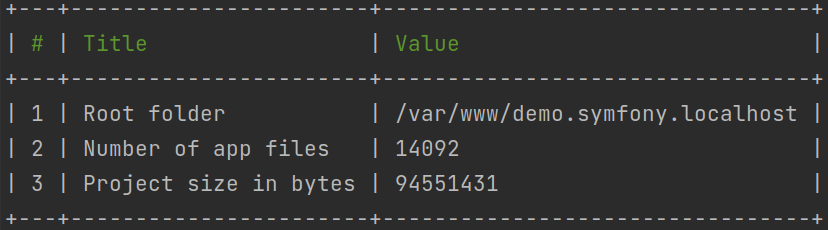

# Symfony Application Stats

Statistics about your Symfony application: size, files, methods, templates, services, etc.



To get one of the statistics options, run the following commands:
- general information: `rts:stats:general`
- to be continued :-) ...

To get more detailed information about a specific service run this command `bin/console debug:container rts.app`


# Installation
You can install the bundle in two ways

From packagist.org
```shell
composer require reiterus/app-stats-symfony
```

From GitHub repository
```json
{
 "repositories": [
  {
   "type": "vcs",
   "url": "https://github.com/reiterus/app-stats-symfony.git"
  }
 ]
}
```

# Tests

To run tests with visual code coverage, launch the command as follows:

```shell
XDEBUG_MODE=coverage ./vendor/phpunit/phpunit/phpunit \
--configuration phpunit.xml \
--testsuite default \
--coverage-html coverage/
```

Test results will be saved in the `coverage` directory.

**Tip**: `vendor/bin/phpunit --generate-configuration`

# License

This library is released under the [MIT license](LICENSE).
