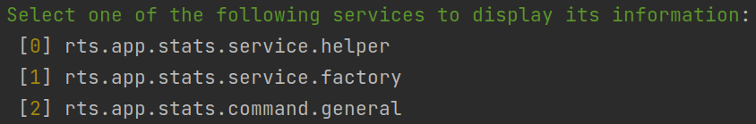

# Symfony Application Stats

Statistics about your Symfony application: size, files, methods, templates, services, etc.

All you have to do is **run a command** from the "rts" namespace.

Directories for analysis: `assets, bin, config, migrations, public, templates, translations, src, tests`

| #   | Title  | Value                           |
|-----| ------ |---------------------------------|
| 1   | Root folder | /var/www/demo.symfony.localhost |
| 2   | All project in bytes | 94539478 (vendor, var, etc) |
| 3   | Working files in bytes  | 12104484 |
| 4   | Number of working files | 519 |
| 5   | ...including "assets" | 13 |
| ...   | ... | ... |
| 12  | ...including "src" | 35 |

| #   | Extension          | Amount                          |
|-----|--------------------|---------------------------------|
| 1   | Root folder        | /var/www/demo.symfony.localhost |
| 2   | js                 | 214                             |
| 3   | woff2              | 60                              |
| ... | ...                | ...                             |
| 8   | php                | 47                              |

| #   | Title                       | Amount                          |
|-----|-----------------------------|---------------------------------|
| 1   | Root folder                 | /var/www/demo.symfony.localhost |
| 2   | Directory list              | src, tests                      |
| 3   | ... found "class"           | 49                              |
| 4   | ... found "interface"       | 5                               |
| ... | ...                         | ...                             |
| 8   | ... found "public function" | 171                             |

To get one of the statistics options, run the following commands:
- general information: `rts:stats:general`
- all files information: `rts:stats:files`
- **only php** files information: `rts:stats:php`

> To get Summary Application Statistics (general, files, php) run the command **rts:stats:summary**

To get more detailed information about a specific service run this command `bin/console debug:container rts.app`



# Installation
You can install the bundle in two ways

From packagist.org
```shell
composer require reiterus/app-stats-symfony
```

From GitHub repository
```json
{
 "repositories": [
  {
   "type": "vcs",
   "url": "https://github.com/reiterus/app-stats-symfony.git"
  }
 ]
}
```

# Tests

To run tests with visual code coverage, launch the command as follows:

```shell
XDEBUG_MODE=coverage ./vendor/phpunit/phpunit/phpunit \
--configuration phpunit.xml \
--testsuite default \
--coverage-html coverage/
```

Test results will be saved in the `coverage` directory.

**Tip**: `vendor/bin/phpunit --generate-configuration`

# License

This library is released under the [MIT license](LICENSE).
